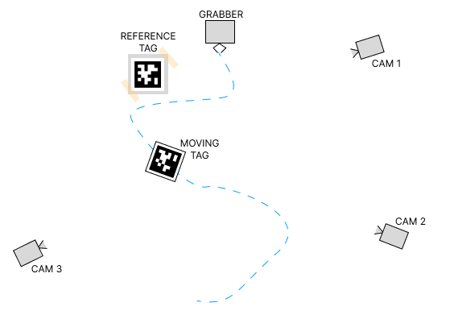
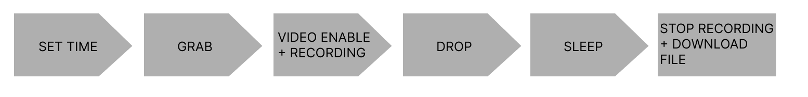
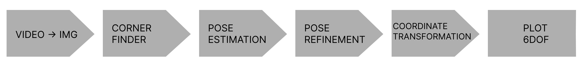
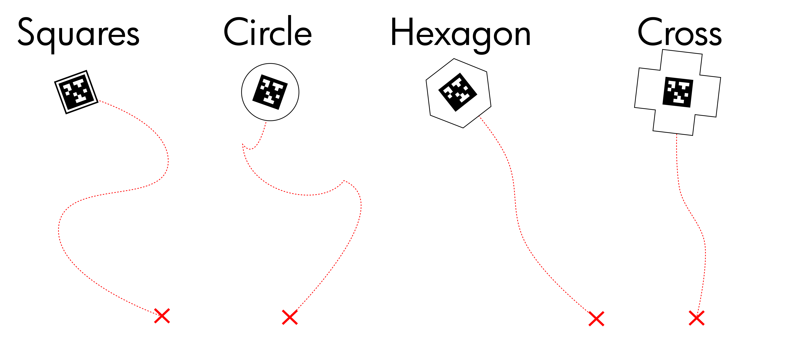

# Automated Paper Tracking
This project aims to automatize an experiment: free falling paper trajectory analysis.

Supervisor : Nana Obayashi

Student : Naël Dillenbourg

## Goal
Track accurately 6 Degrees of freedom of a falling paper and be able to reproduce the experiment hundreds of times to find global patterns. Attempt to extract meaningful data from the experiments.

## Setup
The experiment make use of:
- An Arduino to command a stepper motor to drop and grab a paper.
- A paper (with two different april tags to track the trajectory).
- A reference tag, to compute a relative distance.
- 3 GoPro Cameras (More is better but more computation per experiment).
- A screen (phone or computer) using QR precision time to sync internal clocks of the cameras.

### More information on the Setup
- The cameras record at 2.7K, 250fps, allowing our algorithm to detect a small tag and to capture a good amount of data points.
- Each cameras needs to have it's deformation matrix calculated with a Checkerboard.
- We use a 3.4cm tags from AprilTags, this can be modified by using the hardcoded variable: 'tag_size'
## Experiment pipeline
About every 5 to 10 experiment, it's advised to sync the internal clock to avoid any offset between the cameras.
The experiment program controlling the Arduino and camera can the be enabled. The grabber allows some time to be reloaded with a paper. The cameras are the enabled and start recording. The paper is dropped. Finally, the cameras stop recording and the files are downloaded 

## Processing pipeline
We extract each frame from the videos, compute the offset between each video with milliseconds precision using the metadata. We then compute the position of each tags (reference tag and falling tag), evaluate the reference position for each camera. We then export the relative position and plot the 6 degrees of freedom.

## Documentation
### Provided files
<pre>
.
└── automated-paper-tracking/
    ├── main.py 
    ├── plot.ipynb
    ├── experiment.py
    ├── README.md
    ├── video2traj.py
    ├── preprocessing.py
    ├── videos/
    │   └── vid001/
    │       ├── vid001_cam1.MP4
    │       ├── vid001_cam2.MP4
    │       └── vid001_cam3.MP4
    ├── trajectories/
    │   └── vid001/
    │       ├── vid001_cam1.txt
    │       ├── vid001_cam2.txt
    │       └── vid001_cam3.txt
    ├── working_dir/
    │   ├── vid001_cam1/
    │   │   ├── frame_00000.jpg
    │   │   ├── frame_00001.jpg
    │   │   └── ...
    │   └── ...
    ├── calibration/
    │   ├── calibrate.py
    │   ├── cam1_26K.pkl
    │   ├── cam2_26K.pkl
    │   └── cam3_26K.pkl
    └── misc/
        └── gif.py
</pre>

### Steps
1. Calibrate each cameras using provided checkboard.
    a. Record videos of the [checkboad](/misc/camera-calibration-checker-board_9x7.pdf) with various angles and from various distances with each camera you are going to use.
    b. Generate the deformation matrices using calibration.ipynb. This generates the necessary pickle files and should be done for every calibration recorded at point a.
2. Setup the experiment.
    a. Build the experiment using as many cameras as you want, a servo motor to drop the paper. Be sure to film as much of the falling paper trajectory but leave some redundancy in the trajectory region filmed.
    b. Sync the camera using [GoPro Labs](https://gopro.github.io/labs/control/precisiontime/). GoPros need to be lab enabled.
    b. Run the experiment. Place a paper in the gripper and run the code experiment.py. The files will be automatically downloaded and renamed locally afterwards.
3. Run the data analysis pipeline.
    a. Run "python main.py video_id" where video_id replace the name of the video such as 'vid001'
    b. Visualize the data using plot.ipynb

## Exemple

## Tags
We created QR codes with shapes (square, circle, hexagone, cross).

- [Square paper](misc/square_tag.pdf)
- [Circle paper](misc/circle_tag.pdf)
- [Hexagone paper](misc/hexagone_tag.pdf)
- [Cross paper](misc/cross_tag.pdf)

Additionally, we provide the [refrence tag](misc/reference_tag.pdf).

# Tools used
- [GoPro Precision Date and Time QR for Lab enabled cameras, used for calibration](https://gopro.github.io/labs/control/precisiontime/)
- [Apriltag for video, some code reused and used for calibration](https://github.com/yanshil/video-apriltags)
- [Checkerboard for Camera Calibration is from Mobile Robot Programming Toolkit](https://docs.mrpt.org/reference/latest/)